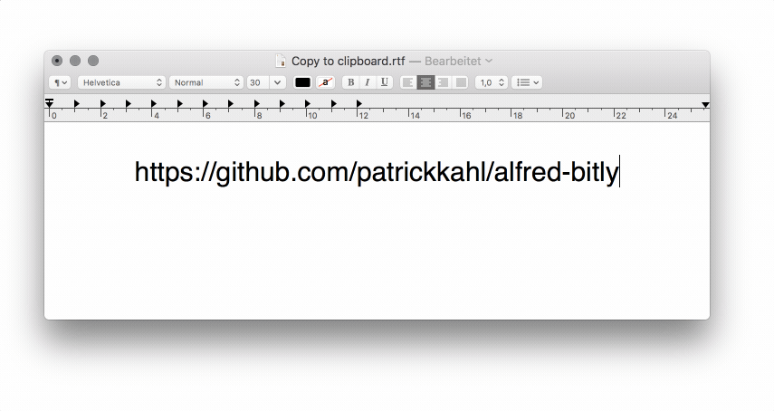
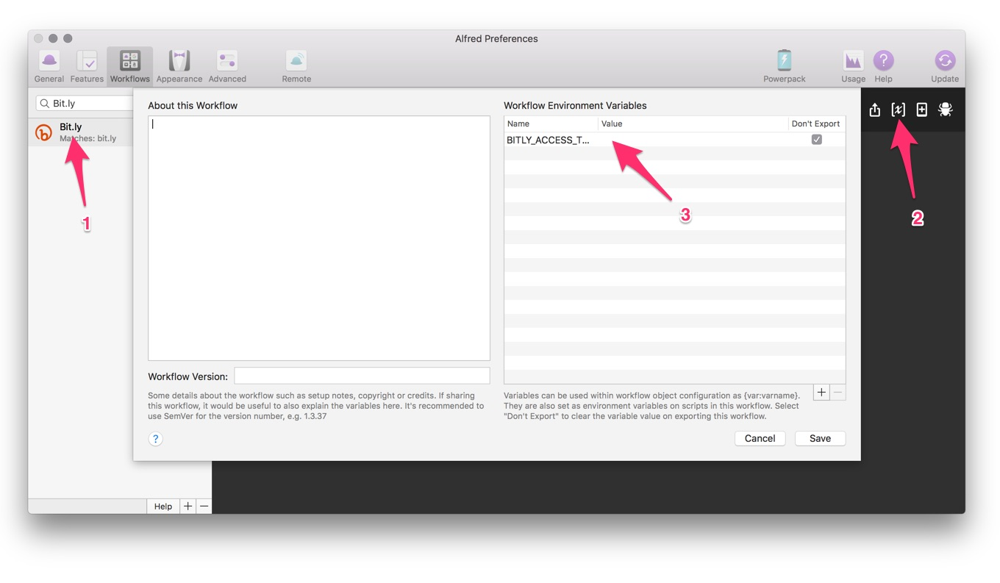

# alfred-bitly [](https://travis-ci.org/patrickkahl/alfred-bitly)

> Shorten URL with bit.ly



## Install

```
yarn add global alfred-bitly
```

*I defaulting to `yarn` but you can use `npm` if you like:*

```
$ npm install --global alfred-bitly
```

*Requires [Node.js](https://nodejs.org) 4+ and the Alfred [Powerpack](https://www.alfredapp.com/powerpack/).*

*Or download the `bitly.alfredworkflow` and double-click the file.*

## First Run

Before running the workflow you need to set your Bit.ly **ACCESS TOKEN**:

[Here](https://bitly.com/a/sign_in?rd=%2Fa%2Foauth_apps) you can create one.

To enter it open Alfred Preferences > Workflows then select Bit.ly, finally click in Configure Workflow and Variables (as seen below):



## Usage

Copy URL to clipboard. Type `bit.ly` in Alfred and <kbd>Enter</kbd>. Now the shorten URL should be in your clipboard.


## License

MIT © [Patrick Kahl](https://github.com/patrickkahl)
